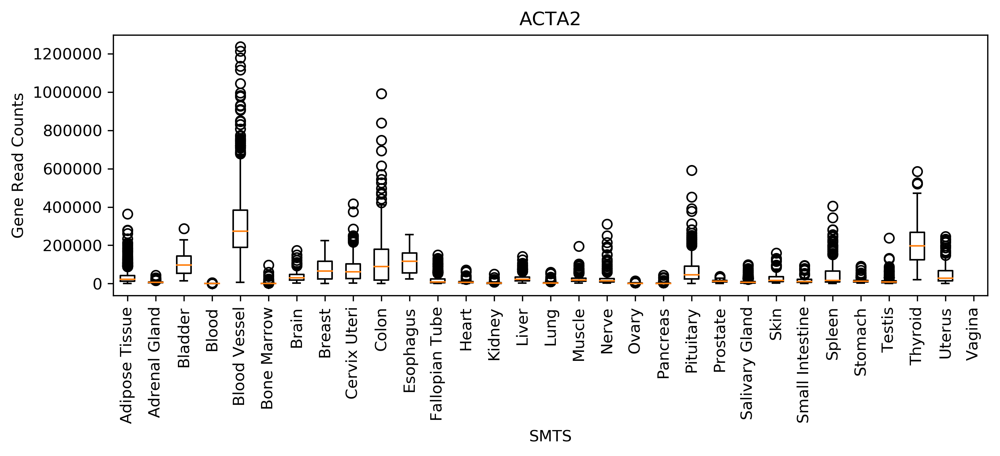

# Hash Table Updated Version
For this second release, I rewrote plot_gtex.py to leverage hash tables.  I included functional and unittests. Much of the instructions on how to use the software in this repo is the same as it was before for the last assignment, so look below under the "parallel-arrays-profiling-and-benchmarking" header to find the readme from that assignment.

Coincidentally, when I updated this program, I wrote it in a way such that it did not plot the tissue types in the same order.  The tissue types are not arranged alphabetically, which is fine.  It just means the graph is in a different order.  Here's the graph:



## Benchmarking the New Hash Table Version vs the Parallel Arrays Version
To compare how the new Hash Table version does compared to the Parallel Arrays version, I compared how long it takes to add to a Hash Table vs doing a binary search from the previous version.  By keeping track of time in python, I found that it takes ~0.0s to fill a Hash table while it takes 0.00879 seconds to do a binary search.  Therefore filling the Hash Table is more time efficient than doing the binary search.  I also made a profile of the updated Hash version called 'hashprofile.txt' that you can view in this repo. I ran both a binary search and a hash table for that file so that the two times can be directly compared.

## Modules, Scripts, and Shell File
plot_gtex.py:  This script creates a box plot of gene charactersistics as specified by the user.  The data for the plot comes from the two files above.

hast-tables-rachelbowyer/test_plot_gtex.py: Contains unit tests for the functions in plot_gtex.py

test_plot_gtex.sh: Contains a functional test of the script plot_gtex.py where it tests if the output file exists after execution and does not exist before execution


## Running Code
In order for the hash table submodule to function correctly, be sure to run
```
git submodule update --init
```

## Example

An example of running plot_gtex.py is 
```
python plot_gtex.py GTEx_Analysis_2017-06-05_v8_RNASeQCv1.1.9_gene_reads.acmg_59.gct.gz GTEx_Analysis_v8_Annotations_SampleAttributesDS.txt ACTA2 SMTS ACTA2.png
```

# parallel-arrays-profiling-and-benchmarking
Parallel Arrays, Profiling, and Benchmarking

The user must download the following files for this code to function.

Files:
- https://github.com/swe4s/lectures/blob/master/data_integration/gtex/GTEx_Analysis_2017-06-05_v8_RNASeQCv1.1.9_gene_reads.acmg_59.gct.gz?raw=true
- https://storage.googleapis.com/gtex_analysis_v8/annotations/GTEx_Analysis_v8_Annotations_SampleAttributesDS.txt


## Modules, Scripts, and Shell File
data_viz.py: contains functions that can be used to visulize data, specifically a box plot function

plot_gtex.py:  This script creates a box plot of gene charactersistics as specified by the user.  The data for the plot comes from the two files above.

test_plot_gtex.py: Contains unit tests for the functions in plot_gtex.py

test_plot_gtex.sh: Contains a functional test of the script plot_gtex.py where it tests if the output file exists after execution and does not exist before execution

## Profiling
As part of this project I profiled test_plot_gtex.py when it was using a linear search to see what was taking the most time.  Turns out the linear search operation was taking by far the most time - 14.8 seconds out of 34.4 seconds in total.  That's 43% of the time!  The second most time expensive operation was {built-in method fromkeys}.  The full report of the profile can be found in plot_gtex.linear_search.txt

## Benchmarking
When I switched over to a binary search the time was greatly reduced. I used GNU time to benchmark the linear search vs binary search versions.  I found that the linear search took 35.29s and the binary search method took only 5.67 seconds.  Therefore the binary search is much more effective.

## Running Files

In order to make the shell file executable, run
```
chmod +x test_plot_gtex.sh
```
then use 
```
./test_plot_gtex.sh
```
to run the shell script

plot_gtex.py can be run but needs user specified inputs in the following order (1) .gz file name (2) .txt file name (3) gene name (4) group type (5) output file name

## Example

An example of running plot_gtex.py is 
```
python plot_gtex.py GTEx_Analysis_2017-06-05_v8_RNASeQCv1.1.9_gene_reads.acmg_59.gct.gz GTEx_Analysis_v8_Annotations_SampleAttributesDS.txt ACTA2 SMTS ACTA2.png
```
